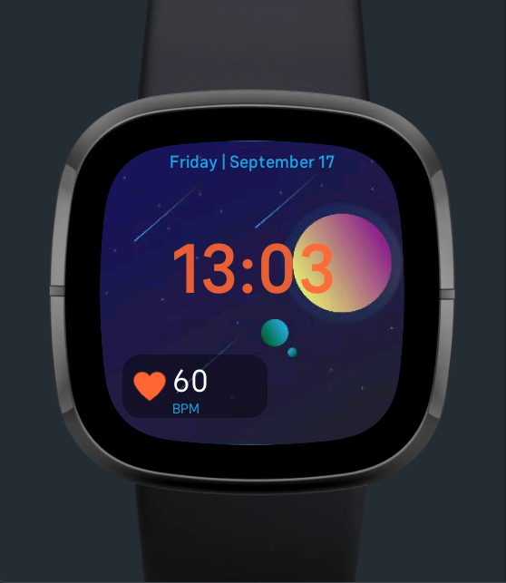

# Minimal Stat Background

This repo contains a watch face built for FitBit OS. The watchface contains the following features:
- Toggle between various metrics
- Set a primary and accent color
- Set an image background

## Getting Started

Here are a few resources for developing watch faces for FitBit OS:

- [Application Architecture](https://dev.fitbit.com/build/guides/application/)
- [Command Line Interface](https://dev.fitbit.com/build/guides/command-line-interface/)
- [Sensor Guide](https://dev.fitbit.com/build/guides/sensors/)
- [Settings](https://dev.fitbit.com/build/guides/settings/)

